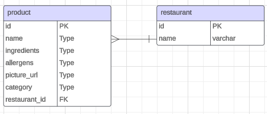

# Fig Data Challenge

This project demonstrates a quick data pipeline to process small csv files.
```
├── data/
└── src
    ├── fig_data_challenge
    │   └── main.py
    └── tests
        ├── test_data/
        └── test_main.py
```
The above file structure displays the main files used for running the script. The data/ folder contains the xlsx file we are processing. The src/ folder contains the actual engine for processing. The tests/ for ensuring the scripts are running properly.



The above is the ERD for this challenge. It can be modified additionally in the future given a better understanding of usual business questions being asked.

## How to run

Navigate to the root folder, then run the following

```bash
poetry shell
poetry install
poetry run python src/fig_data_challenge/main.py
```

## How to test

Navigate to the root folder, then run the following

```bash
pytest
```